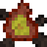
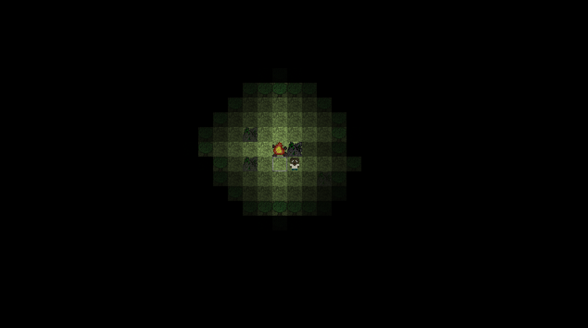

# Woods Game 

Just a weekend project made in Monogame. Build a base stuck in the dark forest through crafting blocks and exploring the world.

## Controls
WASD to move around, right click to place blocks and open doors, left click to mine blocks, C to craft (whilst selecting the crafting block like a bench)

## Crafting
Break a tree to leave a stump on the ground. Use the **stump** to craft:
- Planks from logs
- Benches from planks

Use a bench to craft:
- Campfires from logs
- Doors from glass

Use a campfire to craft:
- Glass from sand

Use any tile to craft:
- Torches from logs

## Drops
Get sand from rocks.
Get logs from trees.

## Screenshots

